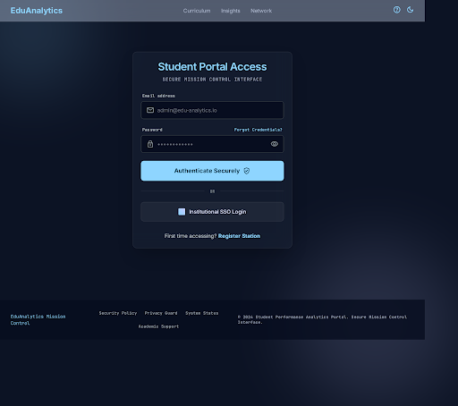
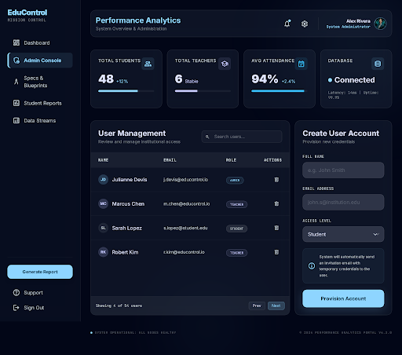
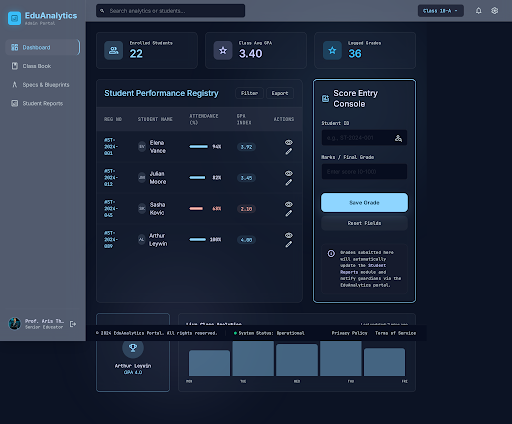
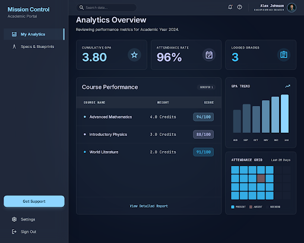

# UI/UX Wireframes and Design System Specs - Student Performance Analytics Portal

This document outlines the visual structure, layout layouts, color tokens, and components of the user interfaces for the Student Performance Analytics Portal.

---

## Design System Tokens

### 1. Colors
The application uses a dark-mode-first glassmorphic palette to create a modern, sleek developer feel.

* **Background**: `#0b0f19` (Deep Midnight Blue)
* **Surface / Cards**: `rgba(255, 255, 255, 0.05)` with `backdrop-filter: blur(12px)`
* **Primary Accent**: `#4f46e5` (Electric Indigo) / Gradient: `linear-gradient(135deg, #6366f1, #4f46e5)`
* **Secondary Accent**: `#06b6d4` (Teal Cyan) / Gradient: `linear-gradient(135deg, #22d3ee, #06b6d4)`
* **Text Main**: `#f8fafc` (Off-white / Slate 50)
* **Text Secondary**: `#94a3b8` (Muted Slate 400)
* **Success Green**: `#10b981` (Emerald)
* **Alert Red**: `#ef4444` (Rose)

### 2. Typography
* **Font Family**: `'Outfit', sans-serif` (Headers) and `'Inter', sans-serif` (Interface, metrics, table listings)
* **Weights**: Regular (400), Medium (500), Semi-Bold (600), Bold (700)

---

## Wireframe Grid Layouts

All screens (except Login) share a common sidebar layout.

```
+-------------------------------------------------------------+
|   LOGO   |   HEADER / PAGE TITLE           [ User Profile ] |
+----------+--------------------------------------------------+
|          |                                                  |
|  Side    |  Main Content Workspace Area                     |
|  Nav     |  (Populated by Dashboard Metric Cards, Grid      |
|  Links   |   Layouts, Graphs, and Tables)                   |
|          |                                                  |
|          |                                                  |
+-------------------------------------------------------------+
```

---

## Core Interface Views

### 1. Login View
* **Type**: Centered Glassmorphic card.
* **Layout**:
  - Logo at top center.
  - Heading: "Student Performance Portal"
  - Inputs: Email Address, Password.
  - Dropdown selector for rapid prototype switching: "Quick Login As..." (Admin, Teacher, Student).
  - Button: "Authenticate Securely".



### 2. Admin Dashboard View
* **Layout**:
  - **Hero Row**: 4 Metric Cards (Total Students, Total Teachers, Avg Attendance, System Status).
  - **Main Area**: 2-Column Split.
    - Left Column (60%): Interactive User Management list (Create/Delete user logins, select roles).
    - Right Column (40%): Global performance metrics panel showing GPA averages across classes.



### 3. Teacher Dashboard View
* **Layout**:
  - **Class Selector**: Dropdown menu at top right (e.g. `Class 10-A`, `Class 12-C`).
  - **Hero Row**: 3 Metric Cards (Class Size, Class Average GPA, Attendance Rate).
  - **Main Area**: 2-Column Split.
    - Left Column (70%): Grade book management grid listing student names, registration IDs, course grades, with an inline edit panel.
    - Right Column (30%): Radial gauge showing target class progress metrics and an attendance logger panel.



### 4. Student Portal View
* **Layout**:
  - **Hero Row**: 3 Metric Cards (Your GPA, Attendance %, Completed Courses).
  - **Main Area**: 2-Column Split.
    - Left Column (60%): Progress chart mapping exam-type grades sequentially and a complete list of course marks.
    - Right Column (40%): Feed of teacher comments, announcements, and a visual calendar showing attendance logs (P, A, L).


